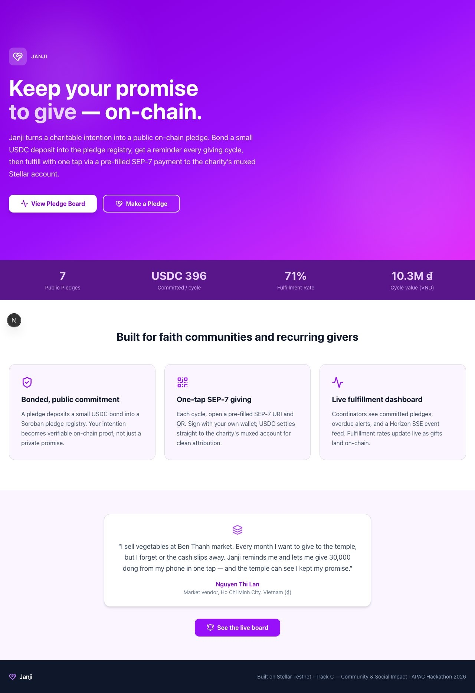
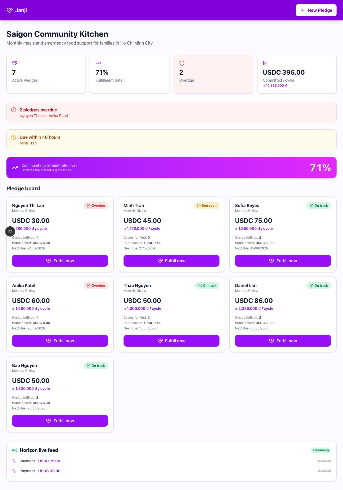
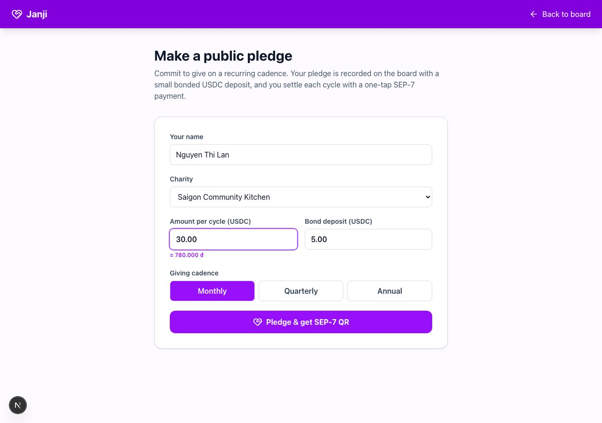
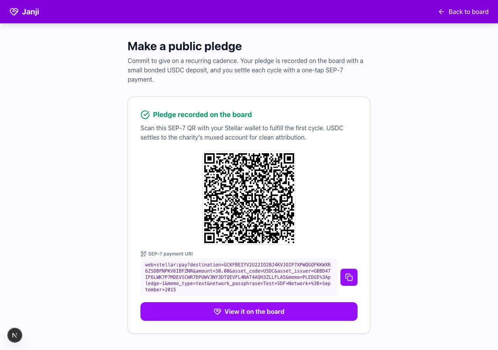
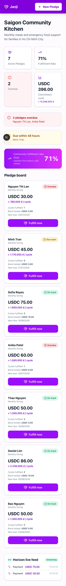

# Janji — Pledge Board / Recurring Charity

Janji turns a charitable intention into a public recurring pledge. Donors choose a monthly USDC amount, see the commitment on a shared board, receive due-date signals, and can open a pre-filled SEP-7 payment QR for the next cycle.

## Live demo

Production URL: https://janji-038.vercel.app

Public repository: https://github.com/nguyenthinhu9357/pledge-board-recurring-charity

The hosted preview uses a safe in-memory demo store, so it does not require PostgreSQL, a funded wallet, or private keys. Demo writes are process-local and labelled as simulated. The real Stellar surface remains in the codebase as the next external-wallet step.

## Mainnet Soroban proof

The pledge-board contract is deployed and initialized on Stellar Public Mainnet:

- Contract: `CAMFL3HZIVSFYZH3HEBV6NLPQNK4LNQVWT6PUYXWE3JEL7YT4QEVWHGT`
- Asset: native XLM SAC
- Verified flow: `initialize -> create_pledge -> fund`
- `create_pledge`: [10132ab480bfea0c88ce2383b0576883490bc0510d822d7bf844fc6a49a4a59b](https://stellar.expert/explorer/public/tx/10132ab480bfea0c88ce2383b0576883490bc0510d822d7bf844fc6a49a4a59b)
- `fund`: [ec0ab47a9bc969f46ebd840df02132b523e3c9c8ed4d37eb6ba5eed2f0aa869e](https://stellar.expert/explorer/public/tx/ec0ab47a9bc969f46ebd840df02132b523e3c9c8ed4d37eb6ba5eed2f0aa869e)

The verified pledge is funded with 0.1 XLM. `release` requires the charity
wallet signature; `refund` becomes available after the due ledger.

## Screenshots







## Run locally

```bash
npm install
npm run dev
```

Open http://localhost:3001. Leave `DRIZZLE_DATABASE_URL` unset or set `DEMO_MODE=true` for the public-style preview.

Validation commands:

```bash
npm test
npm run test:e2e
npm run screenshots
```

## Stellar surface

- Horizon recurring payment intent and proof
- Soroban charity/policy boundary where required
- Due-pledge keeper and provider/event reconciliation

## Readiness status

The public app remains a hackathon demo with simulated in-memory writes. The
Soroban pledge flow is separately verified on Mainnet; full charity release
still uses the external signer boundary described below.

See [`docs/MAINNET_READINESS.md`](docs/MAINNET_READINESS.md).

## Local demo

Use disposable testnet accounts and local environment variables. Follow the scripts in `package.json` and never commit signer or provider credentials.

## Mainnet gate

Mainnet requires donor-signed payments, charity verification, exact Horizon proof, idempotent recurring schedules, and independently authenticated event ingestion.

## Soroban MVP artifact

The minimal pledge registry is in [`contracts/commitment/`](contracts/commitment/).
Run `cargo test --manifest-path contracts/commitment/Cargo.toml`. The deployment
manifest remains `not-deployed` until an external signer completes upload,
deploy and initialize.

## Soroban XLM surface

The minimal contract in `contracts/pledge-board/` implements
`OPEN -> FUNDED -> PAID` plus deadline refunds and cancellation with native XLM
SAC. Run `cargo test --manifest-path contracts/pledge-board/Cargo.toml`. The
unsigned XDR workflow is documented in [`docs/MAD_OPS.md`](docs/MAD_OPS.md).
